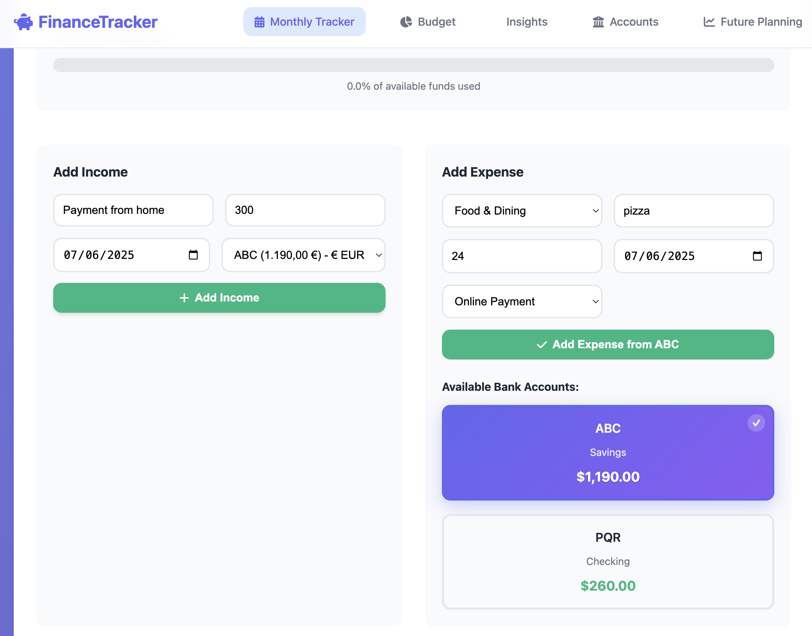
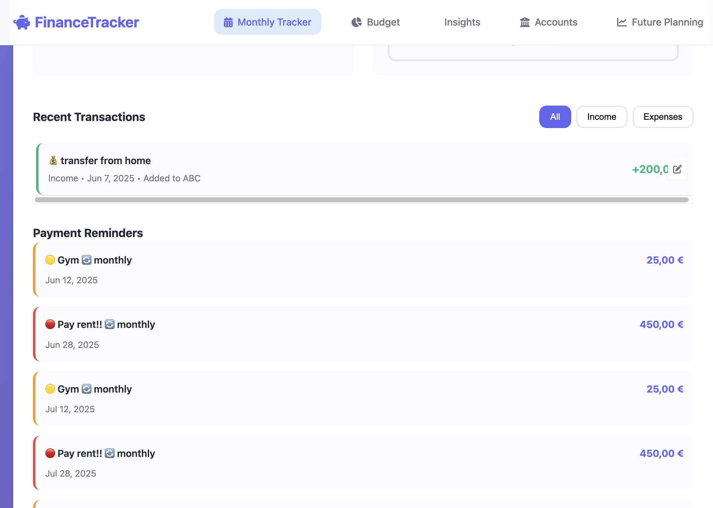
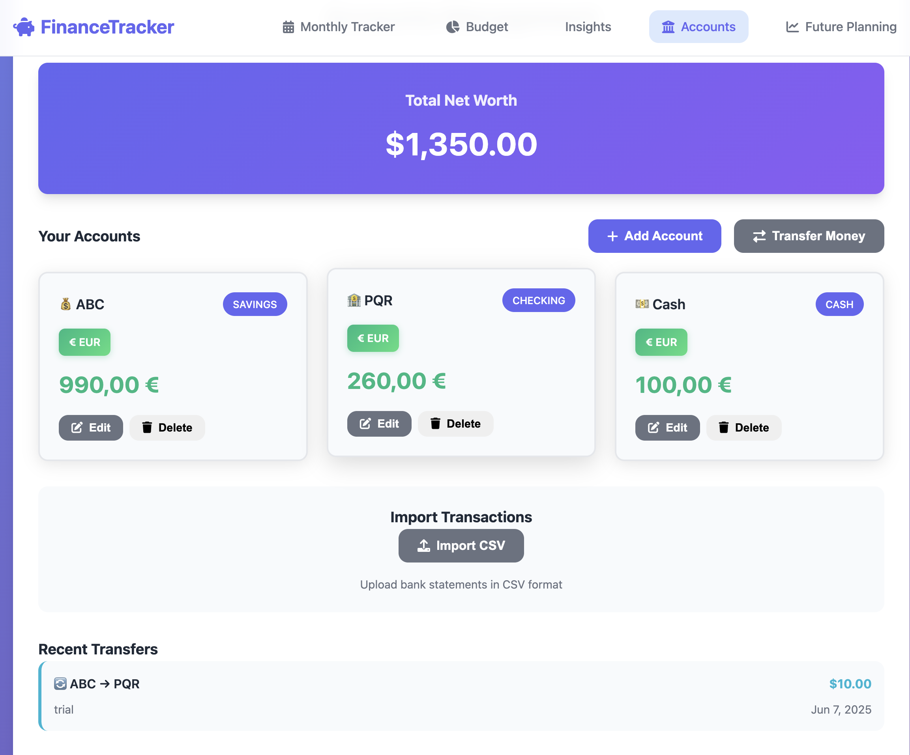
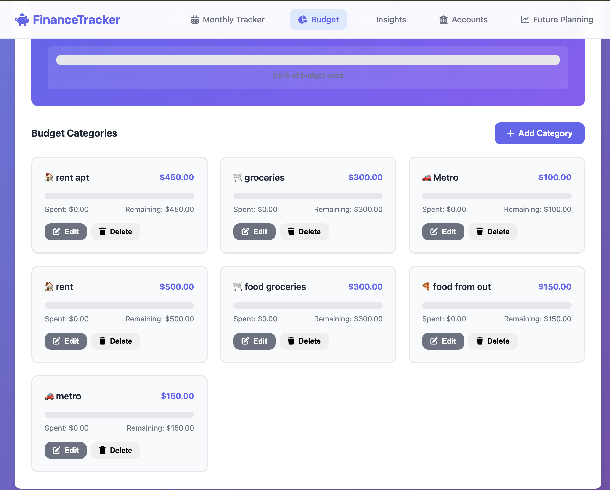
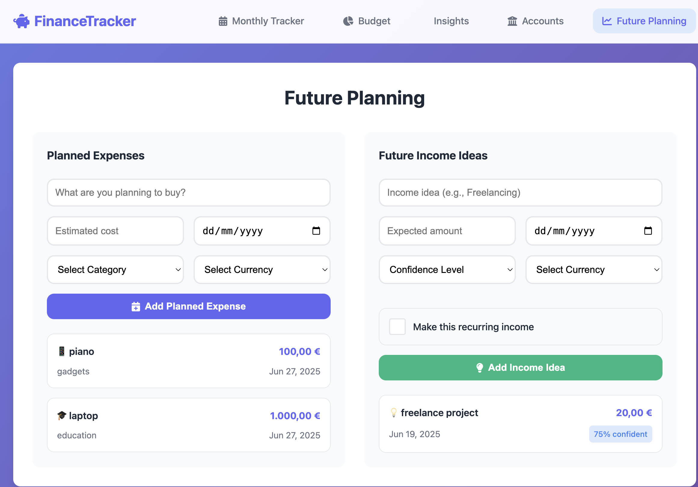
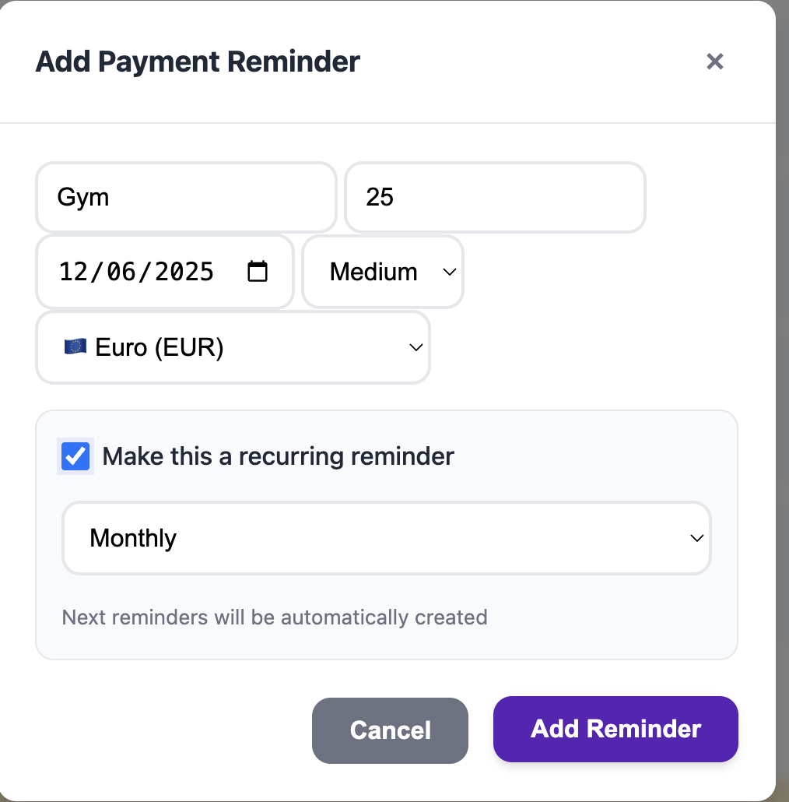
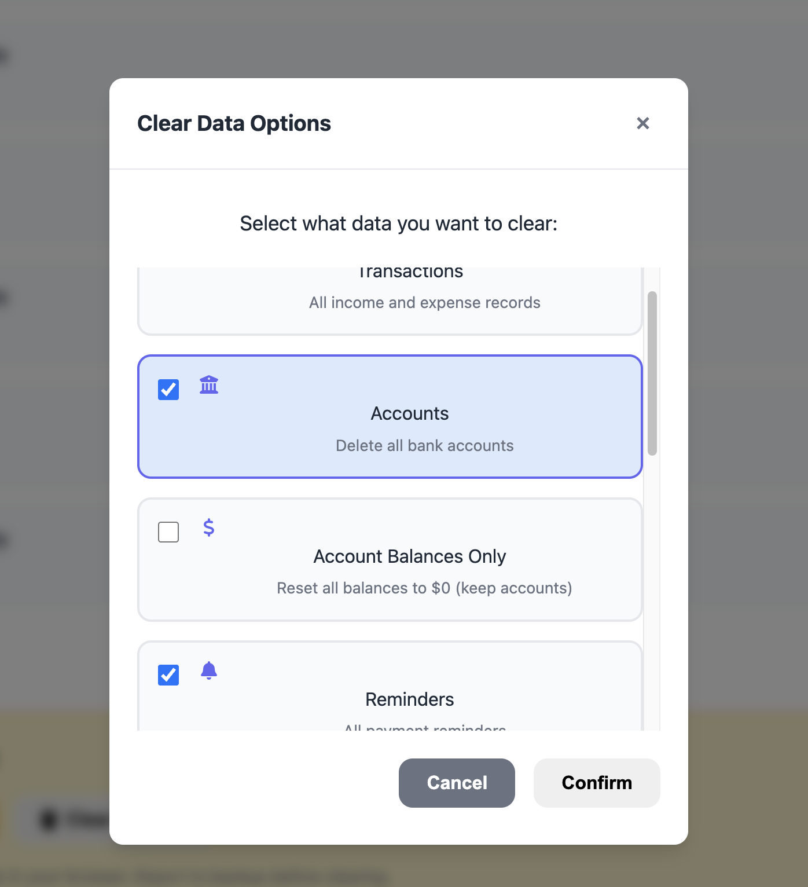

# 🏦 Student Finance Tracker

A beautiful, intuitive personal finance management tool designed specifically for students. Track income, expenses, accounts, and plan for the future with a clean, modern interface.

## 📸 Screenshots

### 🎯 Dashboard Overview

> **Monthly Tracker**: Real-time financial overview with stats and progress tracking

### 💰 Transaction Management

> **Add Income & Expenses**: Easy-to-use forms with multi-currency support


*Income and expense forms with bank account selection and payment method options*


*Filterable transaction history with edit capabilities and multi-currency support*

### 🏦 Account Management

> **Multi-Currency Accounts**: Support for 17+ currencies with beautiful account cards


*Account overview with multi-currency support, balance tracking, and transfer capabilities*

### 📊 Budget Management

> **Smart Budgeting**: Category-based budget tracking with visual progress


*Budget dashboard with category breakdown, utilization tracking, and progress indicators*

### 🔮 Future Planning

> **Smart Planning**: Track planned expenses and income ideas


*Future expense planning and income ideas with confidence levels and recurring options*

### ⏰ Reminders & Notifications

> **Recurring Reminders**: Never miss a payment with smart reminder system


*Color-coded reminders with priority levels and recurring options*

### 🗂️ Data Management

> **Flexible Data Control**: Selective data clearing and export options


*Selective data clearing with checkbox options for precise control*

## ✨ Features

### 📊 Monthly Tracker

- **Dashboard Overview**: Real-time display of total account balance, income, and spending
- **Multi-Currency Support**: 17+ currencies with proper localization (USD, EUR, GBP, JPY, etc.)
- **Smart Progress Bar**: Visual representation of spending vs available funds
- **Transaction Management**: Easy forms for adding income with bank account selection
- **Category Icons**: Visual categorization with emojis (🍕 Food, 🚗 Transport, 📚 Education, etc.)
- **Advanced Filtering**: View all transactions, income only, or expenses only
- **Bank Account Integration**: Choose which account to credit/debit for each transaction

### 🏦 Accounts Management

- **Multiple Account Types**: Checking, Savings, Cash, Crypto, Investment accounts
- **Multi-Currency Accounts**: Each account can have its own currency
- **Real-Time Balance Tracking**: Account balances update automatically with transactions
- **Account Transfers**: Move money between accounts with currency support
- **Direct Account Management**: Edit/delete accounts with confirmation dialogs
- **CSV Import**: Import bank statements and transaction data
- **Visual Account Cards**: Beautiful cards showing currency, balance, and account type

### ⏰ Smart Reminders

- **Priority Levels**: Low, Medium, High priority color-coding
- **Recurring Reminders**: Weekly, Monthly, Yearly automatic recurrence
- **Multi-Currency Reminders**: Each reminder can have its own currency
- **Visual Indicators**: 🔄 icon for recurring reminders with frequency display
- **Smart Notifications**: Due date tracking with urgency indicators

### 📊 Budget Management

- **Category-Based Budgets**: Set limits for different spending categories
- **Visual Progress Tracking**: Progress bars showing budget utilization
- **Over-Budget Alerts**: Clear indicators when limits are exceeded
- **Multi-Currency Budgets**: Support for different currencies in budget categories
- **Smart Suggestions**: AI-powered insights based on spending patterns

### 📈 Insights & Analytics

- **Interactive Charts**: Spending breakdown pie charts and trend line graphs
- **Time-Based Analysis**: Monthly view filters and historical comparisons
- **Smart Suggestions**: Personalized recommendations based on spending patterns
- **Upcoming Items**: 7-day preview of upcoming reminders and planned expenses
- **Budget Utilization**: Real-time tracking of budget vs actual spending

### 🔮 Future Planning

- **Planned Expenses**: Track upcoming purchases with dates, categories, and currencies
- **Income Ideas**: Brainstorm potential income sources with confidence levels
- **Multi-Currency Planning**: Plan expenses and income in different currencies
- **Goal Visualization**: Clear display of future financial commitments

### 🗂️ Data Management

- **Selective Data Clearing**: Choose exactly what data to clear with checkboxes
- **Account Balance Reset**: Reset balances without deleting account structures
- **Data Export**: Download complete backup as JSON file
- **CSV Import/Export**: Import bank statements in standard CSV format
- **Privacy-First Storage**: All data stored locally in browser (no cloud sync)

## 🎯 Design Features

- **Clean & Minimalist**: Student-friendly pastel color scheme
- **Responsive Design**: Works perfectly on desktop, tablet, and mobile
- **Smooth Animations**: Beautiful transitions and hover effects
- **Modern UI**: Glass morphism effects and contemporary design patterns
- **Accessibility**: High contrast, keyboard navigation, and screen reader friendly

## 🚀 Quick Start

1. **Clone or Download** this repository
2. **Open `index.html`** in your web browser
3. **Start using immediately** - no installation required!

```bash
# If using a local server (recommended for development)
python -m http.server 8000
# or
npx serve .
```

## 📱 How to Use

### Adding Transactions

1. Navigate to **Monthly Tracker**
2. Use the **Add Income** form for money coming in (jobs, allowances, etc.)
3. Use the **Add Expense** form for money going out
4. All transactions appear instantly in the dashboard and transaction list

### Managing Accounts

1. Go to **Accounts** tab
2. Click **Add Account** to create new accounts
3. Import CSV files from your bank for bulk transaction import
4. View your total net worth at a glance

### Planning Ahead

1. Visit **Future Planning** tab
2. Add planned expenses for upcoming purchases
3. Track income ideas with confidence levels
4. Stay motivated with your financial goals

## 💾 Data Storage

- **Local Storage**: All data is stored in your browser's local storage
- **Privacy First**: No data leaves your device
- **Persistent**: Your data persists between sessions
- **Demo Data**: Includes sample data for new users to explore features

## 🛠️ Technical Details

### Built With

- **HTML5**: Semantic, accessible markup
- **CSS3**: Modern styling with CSS Grid, Flexbox, and custom properties
- **Vanilla JavaScript**: No frameworks, fast and lightweight
- **Font Awesome**: Beautiful icons throughout the interface
- **Local Storage API**: Client-side data persistence

### Browser Support

- Chrome 80+
- Firefox 75+
- Safari 13+
- Edge 80+

## 🔧 Customization

### Changing Colors

Edit the CSS custom properties in `styles.css`:

```css
:root {
    --primary-color: #6366f1;
    --success-color: #10b981;
    --danger-color: #ef4444;
    /* ... more colors */
}
```

### Adding Categories

Modify the category options in `index.html` and update icons in `script.js`:

```javascript
getCategoryIcon(category) {
    const icons = {
        food: '🍕',
        transport: '🚗',
        your_new_category: '🎯'
    };
    return icons[category] || '💸';
}
```

## 🎯 Future Enhancements

### Phase 1: Smart Features

- [ ] Budget suggestions based on spending patterns
- [ ] Daily budget notifications
- [ ] Weekly/Monthly view toggles
- [ ] Spending analytics with Chart.js
- [ ] Category-wise spending breakdown (pie charts)

### Phase 2: Advanced Analytics

- [ ] Spending trend analysis
- [ ] Income vs. expense forecasting
- [ ] Savings rate calculations
- [ ] Monthly/yearly reports
- [ ] Export to PDF functionality

### Phase 3: Collaboration & Cloud

- [ ] Share budgets with family/roommates
- [ ] Cloud sync across devices
- [ ] Goal sharing and accountability
- [ ] Social features for financial challenges

### Phase 4: React Migration

```javascript
// Convert to React for enhanced functionality
const FinanceTracker = () => {
    const [transactions, setTransactions] = useState([]);
    const [accounts, setAccounts] = useState([]);
    // ... component logic
};
```

### Phase 5: Backend Integration

#### Option A: Simple Setup (Firebase/Supabase)

```javascript
// Firebase integration
import { initializeApp } from 'firebase/app';
import { getFirestore } from 'firebase/firestore';

const app = initializeApp(firebaseConfig);
const db = getFirestore(app);
```

#### Option B: Full-Stack Setup (Node.js + PostgreSQL)

```javascript
// Express backend with PostgreSQL
const express = require('express');
const { Pool } = require('pg');

const app = express();
const pool = new Pool({
    connectionString: process.env.DATABASE_URL
});
```

## 🤝 Contributing

1. Fork the repository
2. Create a feature branch (`git checkout -b feature/amazing-feature`)
3. Commit your changes (`git commit -m 'Add amazing feature'`)
4. Push to the branch (`git push origin feature/amazing-feature`)
5. Open a Pull Request

## 📝 CSV Import Format

For importing bank statements, use this CSV format:

```csv
date,description,amount,type
2024-01-01,Part-time Job,800,income
2024-01-02,Groceries,-120,expense
2024-01-03,Coffee,-5,expense
```

## 🔐 Privacy & Security

- **No Data Collection**: We don't collect any personal data
- **Local Only**: All data stays on your device
- **No Tracking**: No analytics or tracking scripts
- **Open Source**: Full code transparency

## 📱 Mobile App Potential

This web app can be easily converted to a mobile app using:

- **Progressive Web App (PWA)**: Add offline capability and app-like experience
- **React Native**: Cross-platform mobile development
- **Ionic**: Hybrid mobile app framework
- **Capacitor**: Web apps as native mobile apps

## 🎓 Educational Value

Perfect for:

- **Students** learning personal finance
- **Young professionals** starting their financial journey
- **Anyone** wanting a simple, beautiful expense tracker
- **Developers** learning modern web development practices

## 📞 Support

Having issues? Here are some common solutions:

- **Data not saving**: Check if local storage is enabled in your browser
- **App not loading**: Try refreshing the page or clearing browser cache
- **Import not working**: Ensure CSV follows the correct format
- **Mobile issues**: Use the latest version of your mobile browser

## 📄 License

This project is licensed under the MIT License - see the [LICENSE](LICENSE) file for details.

## 🌟 Star History

If you find this project helpful, please consider giving it a star! ⭐

---

**Made with ❤️ for students everywhere**

*Start your financial journey today with this beautiful, intuitive finance tracker!*

## 📸 Screenshots Included

All screenshots are included in the `screens/` folder:

- `expense_income.png` - Main dashboard with income and expense forms
- `recent_transactions.png` - Transaction history with filtering options
- `account.png` - Multi-currency account management interface
- `budget.png` - Budget tracking with visual progress indicators
- `future_planning.png` - Planned expenses and income ideas interface
- `add_payment_reminder.png` - Payment reminder creation modal
- `clear_data.png` - Selective data management options

These screenshots showcase the app's complete functionality across all major features.

## 🔗 Live Demo

Check out the live application at: [https://akiyer18.github.io/Money-tracker/](https://akiyer18.github.io/Money-tracker/)

*Note: GitHub Pages may take a few minutes to deploy after the first push*
